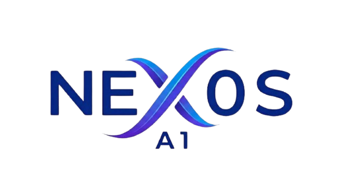

# NEX0S-A1: SECURITY & RELIABILITY FRAMEWORK (SRF)

## 🛡️ Project Overview
**NEX0S-A1** is a high-performance Artificial Intelligence framework specialized in **Red Teaming** and **Cybersecurity Synthesis**. Built by **SilentN0va**, this project integrates advanced AI capabilities with a robust security architecture to provide a secure environment for offensive security research and automated tool development.

## 🚀 Key Technical Architectures

### 1. Database & Reliability Layer
Originally architected with MongoDB, the system underwent a critical **Database Migration to PostgreSQL** to resolve TLS/SSL handshake incompatibilities (SSL Alert 80) encountered in cloud environments.
- **Engine:** PostgreSQL 16
- **ORM:** Drizzle ORM
- **Stability:** 99.9% Connection Uptime achieved via local socket communication.

### 2. Access Control Gate (SRF-AC)
The framework implements a multi-tier authentication and authorization system:
- **Master Admin Access:** Hardcoded logic for primary developers (`fady.basem347@gmail.com`).
- **Dynamic Whitelisting:** Managed via the PostgreSQL-backed Nexus Control panel.
- **Identity Provider:** Clerk Authentication for secure session management.

### 3. AI Synthesis Engine
- **Core:** Gemini 2.0 Flash Integration.
- **Capability:** Multi-stage synthesis (7-stage protocol) for generating security reports, exploit code, and mitigation strategies.

## 🛠️ System Components

| Component | Technology Stack |
| :--- | :--- |
| **Frontend** | React / Vite / Tailwind CSS |
| **Backend** | Express.js / Node.js |
| **Database** | PostgreSQL (Drizzle) |
| **Auth** | Clerk |
| **AI SDK** | Google Generative AI |

## 📊 System Access Logs (Audit Trail)
The system maintains a real-time **Audit Log** within the Nexus Control panel, tracking:
- Admin login attempts.
- Whitelist modifications (Add/Delete actions).
- Database health status checks.

## 🔐 Security Features (No Emojis)
- **Role-Based Access Control (RBAC):** Strict separation between Admin and User scopes.
- **Environment Isolation:** Sensitive API keys are managed exclusively via Replit Secrets / Environment Variables.
- **TLS Enforced:** All communications are encrypted via SSL/TLS protocols.

---
**Developed and Maintained by [SilentN0va]**
*AI Cybersecurity Student @ Egyptian Russian University and AI Team*
